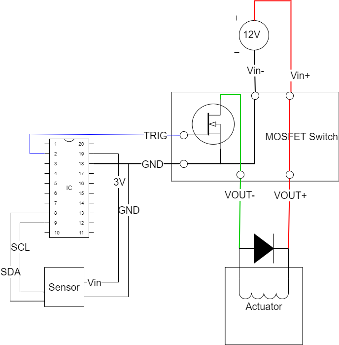

# Sip-n-Puff Example

## Intro

This repos exists for the sole purpose of helping a new user jumpstart his Assistive Technology project.

## Affiliates

[ATMakers.org](http://www.ATMakers.org) and the "ATMakers - Makers and Users" Facebook group.

Please see the videos linked to in the Summary box on this Thingiverse [post](https://www.thingiverse.com/thing:3458117).

## Remarks

The Sip-n-Puff.ino [code](Sip-n-Puff/Sip-n-Puff.ino) is heavily commented. Start there.

In converging the sensor code SparkFun defaults to PSI and won't convert to hPa. Adafruit can readPressure() in PSI by default if the last parameter (in a long list of defaults) in the the constructor is 1. Not worth the trouble since I think the SparkFun module will be selected. Then we'll just go with PSI everywhere and be done with it.

## Status

|    Date    | Status                                                       |
| :--------: | ------------------------------------------------------------ |
| 2022-11-26 | Added Neopixel code.                                         |
| 2022-11-25 | Added support for the SparkFun MicroPressure (Qwiic) sensor. |
| 2022-11-25 | It compiles. No Neopixel support yet.                        |

## Code Instructions

Copy the Sip-n-Puff directory into your Arduino directory (usually in My Documents). Open in the Arduino IDE.

## Proposed Components

### Pressure Sensor

Adafruit MPRLS Pressure Sensor [#3965](https://www.adafruit.com/product/3965) or SparkFun [SEN-16476](https://www.sparkfun.com/products/16476).

### Microcontroller

Adafruit QT Py SAMD21 [#4600](https://www.adafruit.com/product/4600). **SELECTED**

### Low-side Switch

5-36V 15A N-channel MOSFET on [Amzn](https://smile.amazon.com/dp/B07XJSRY6B).

### Solenoid

12V 0.3A 10mm stroke 4N [Amzn](https://www.amazon.com/dp/B07Z3HYDBV)

## Schematic

The following wiring diagram has been put forth. The microcontroller (IC) pinouts are not particularly cromulent.

